# ComfyWebStudio — user guide

ComfyUI runs one graph at a time. This runs *many*, in order, passing results between them, and cuts the
output together on a timeline.

A **project** holds **workflows** (ComfyUI graphs) and **shots**. A shot is a canvas of **steps** — each
step runs one workflow — wired together by their **ports**. Run a step on its own, a chain, a whole shot,
or the entire timeline.

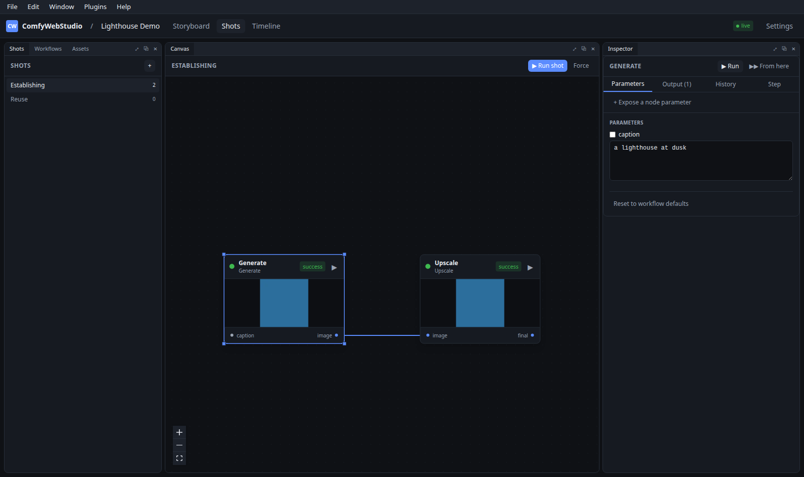

Everything below is the app as it actually behaves; the screenshots are generated by
`scripts/docs_screenshots.py` against a running instance, so they do not drift from the UI.

---

## Contents

1. [Setting up](#setting-up)
2. [The workspace](#the-workspace)
3. [Building a shot](#building-a-shot)
4. [Parameters](#parameters)
5. [Running things](#running-things)
6. [Editing a workflow in ComfyUI](#editing-a-workflow-in-comfyui)
7. [Reusing work](#reusing-work)
8. [Storyboards](#storyboards)
9. [Timeline and rendering](#timeline-and-rendering)
10. [Projects, plugins and history](#projects-plugins-and-history)
11. [Settings](#settings)
12. [When something looks wrong](#when-something-looks-wrong)

---

## Setting up

```bash
./start.sh          # macOS / Linux
start.bat           # Windows
```

That installs what is missing, builds the frontend and serves the app on <http://127.0.0.1:8500>.

**Install the node pack into ComfyUI.** This is not optional: ComfyUI's IMAGE / AUDIO / LATENT values are
in-memory tensors that vanish when execution ends, so nothing could be passed from one workflow to the next
without nodes that persist them.

```bash
make link-nodepack       # symlinks comfy_nodes into ComfyUI/custom_nodes, then restart ComfyUI
```

ComfyUI's log should say `WebStudio node pack <version> (protocol 1) loaded`, and its node menu gains a
**WebStudio** category: `WS Image Input`, `WS Image Output`, `WS Text Input` and so on.

Finally point the app at ComfyUI on the [Settings](#settings) page — **Test connection** reports the
version, the GPU and whether the node pack is answering.

---

## The workspace

Every panel is a dockable widget. Drag one by its tab and the drop target is previewed before you let go:

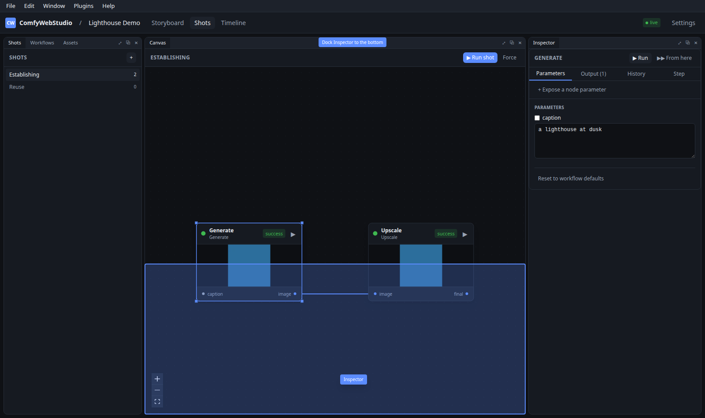

| Drop it… | and it… |
|---|---|
| in the **middle** of a panel | joins that panel as another tab |
| on an **edge** of a panel | splits that panel, taking that side |
| on the **outer rim** of the workspace | spans the full width or height |
| **outside** the window | floats in a window of its own |

Dropping on an edge is what gives you panels *beside*, *above* and *below* each other rather than only
stacked as tabs:

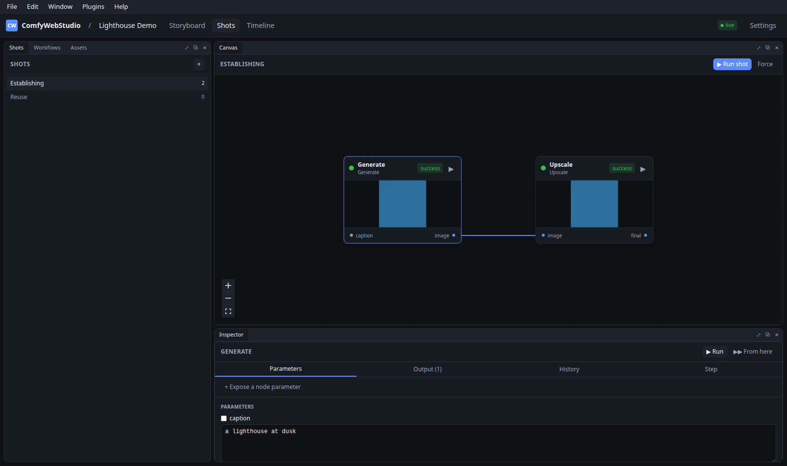

Drag the seam between any two panels to resize them. Every tab strip has **⤢** to fill the workspace with
that panel and **⤡** to put the layout back — double-clicking a tab does the same. **⧉** floats it, **✕**
hides it. Panels you hide keep their place, so showing one again puts it back where it was.

The layout persists. **Window ▸ Panels** shows anything hidden, and **Window ▸ Reset Layout** starts over.
<kbd>Ctrl</kbd>+<kbd>1</kbd> and <kbd>Ctrl</kbd>+<kbd>2</kbd> toggle Workflows and the Inspector.

---

## Building a shot

**Get a workflow in.** In the Workflows panel: **From ComfyUI** lists what ComfyUI already has saved, or
**+ File** takes a `.json` you exported. Either format works — a UI graph or an API-format prompt.

Importing reads the graph and works out two things:

- **Ports** — every `WS*Input` and `WS*Output` node becomes a named, typed port on the step.
- **Parameters** — the values worth editing from here, without opening ComfyUI.

**Add steps.** Drag a workflow onto the canvas, or right-click the canvas ▸ **Add step**.

**Chain them.** Drag from an output port to an input port. Kinds are checked as you drag, so an image
output will not attach to a text input — and the reason is given rather than the link silently failing.

**Value nodes.** Right-click the canvas to add a text, number, boolean or media node and wire it into an
input. That is how a prompt shared by three steps lives in one place.

---

## Parameters

Select a step and the Inspector shows its parameters. Two kinds arrive there:

- from the pack's input nodes (`WS Text Input`, `WS Int Input`, …), which the workflow's author exposed
  deliberately;
- **any widget of any node**, via **+ Expose a node parameter** — for workflows you would rather not modify.

Subgraphs are handled too: a promoted input on a subgraph appears as a parameter like `$30.seed`.

A value you type is stored **on the step**, not in the workflow, so two steps using the same workflow can
differ. **Reset to workflow defaults** clears them.

> **When a value changes in ComfyUI.** A step that was holding the workflow's old default follows the new
> value automatically. A value you deliberately set on that step is kept — the app says which ones, rather
> than overwriting your work — and clearing it lets that step follow ComfyUI again.

---

## Running things

| Action | Runs |
|---|---|
| **▶** on a node | that step, plus anything it depends on |
| **From here** in the Inspector | that step and everything downstream |
| **Run shot** | the whole shot, in dependency order |
| **Force** | the same, ignoring cached results |

Progress is live on the nodes. Results appear in the Inspector's **Output** tab and as a preview on the
node itself; hovering a video preview plays it, and moving across it scrubs.

**Caching.** A step whose workflow, parameters and inputs are unchanged reports `cached` and ComfyUI is
not called. Change a parameter and that step — and everything downstream of it — re-runs.

**Failures** name the ComfyUI node that failed, and dependent steps are marked *skipped* rather than
failed, so it is obvious which one to fix.

---

## Editing a workflow in ComfyUI

**Open in ComfyUI** on a workflow (or a step's right-click menu) opens the real ComfyUI, embedded:

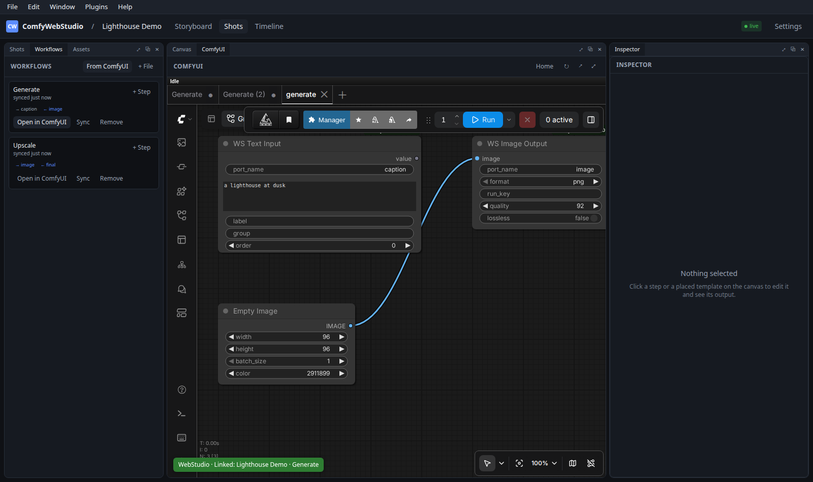

It is the genuine article, not a reimplementation — your extensions, your node packs, your settings. Fill
the workspace with it while you work, and put the layout back when you are done:

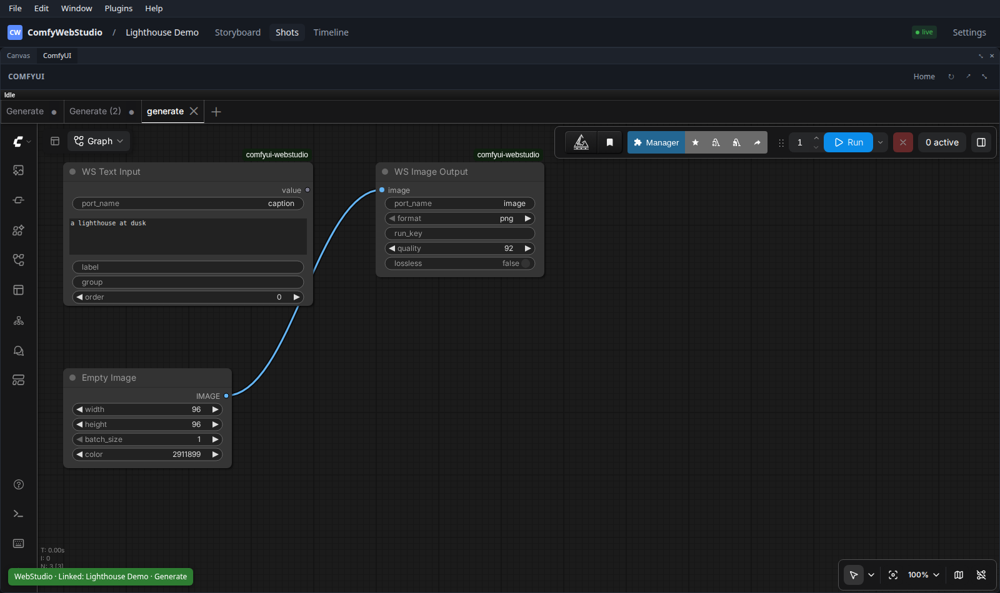

Shift-click **Open in ComfyUI** to use a real browser tab instead, which is better on a second monitor.

**It opens the workflow ComfyUI has saved**, as a properly named workflow — so <kbd>Ctrl</kbd>+<kbd>S</kbd>
saves in place instead of asking for a name, and the file it writes is the one this app reads back.

**Saving syncs back.** Press <kbd>Ctrl</kbd>+<kbd>S</kbd> in ComfyUI, or click the green **WebStudio**
badge. New ports appear here immediately; a port you deleted is reported along with the links it broke,
rather than failing later at run time. Merely *opening* a workflow changes nothing — only a real save does.

A workflow imported **From ComfyUI** keeps its original file, so editing it edits the file it came from.
Anything else is saved under `workflows/ComfyWebStudio/<project>/` in ComfyUI's user directory.

---

## Reusing work

**Drag a shot onto another shot's canvas** and it becomes a single node standing for everything inside it:

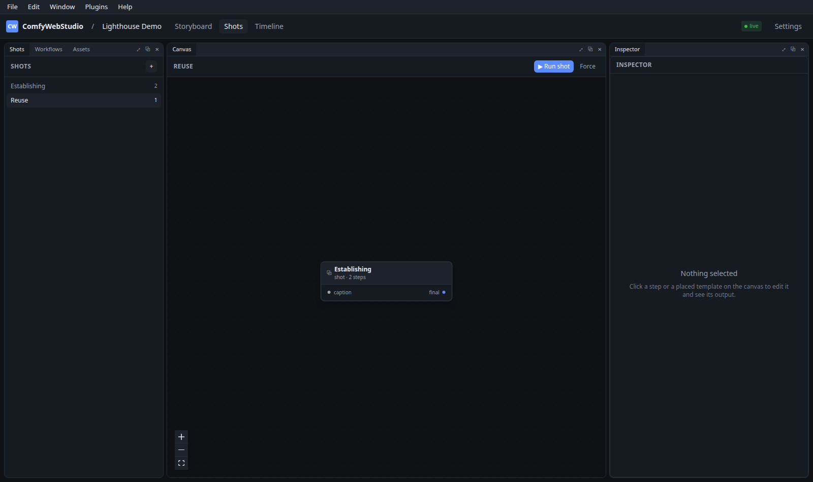

It behaves like any other node — ports to wire, parameters to edit, previews of what it produced — with two
properties worth knowing:

- **It is live.** There is no copy: editing the source shot updates every node standing for it.
- **Its values are its own.** What you type on the node stays on that node. Two placements of one shot
  hold different values and neither writes back to the shot they came from.

Nesting goes as deep as you like. A shot cannot contain itself, and the app refuses the placement rather
than letting you build a loop.

**Templates** are the same idea for reuse *across projects*: **Save as template** lifts a shot into a
shared library, bundling the workflows it needs so it travels. Placed templates track their library entry
and flag themselves when it moves on, with **update** to catch up.

---

## Storyboards

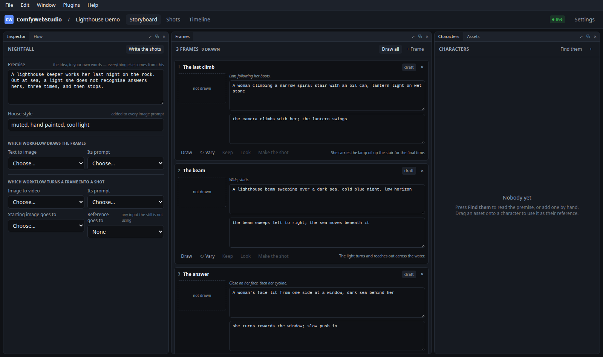

A storyboard turns a premise into a sequence of frames, draws each one, and then turns the frames into
shots. It is the fast way from *an idea* to *a folder of shots wired to a workflow* — the parts you would
otherwise do by hand, repeatedly, at four in the morning.

It needs a language model. Point it at one first, under **Settings ▸ Language models**; see
[Settings](#settings) below.

**1. Write.** Type a premise, say how many shots, press **Write**. Each frame comes back with four things
kept deliberately separate, because they are read by different things:

| Field | Who reads it | What it is |
|---|---|---|
| **Action** | you | what happens, in prose |
| **Camera** | you | the framing, in shorthand |
| **Image prompt** | the text-to-image workflow | one frozen moment, never motion |
| **Shot prompt** | the image-to-video workflow | motion only, never the scene again |

Everything is editable. The model writes a first draft, not a contract — rewrite any field, reorder frames
by dragging, add or delete them.

**2. Characters.** **Suggest** reads the premise and names whoever recurs, each with an *appearance* written
for an image generator so the same face survives from frame to frame. Give a character a reference image and
it can be fed to workflows that accept one. Characters are attached per frame, so only the ones actually in
a shot are sent.

**3. Draw.** Pick a text-to-image template and which of its inputs is the prompt, then **Draw all** renders
every frame. Each picture appears on its frame as that frame finishes — nothing to press first — with a
percentage across the thumbnail while it is being drawn and a bar above the strip for the board as a whole:
how many of the frames are done, and **Stop** if it is going wrong.

Drawing is the part you go round twice. Per frame:

| Button | What it does |
|---|---|
| **Redraw** | draws this frame again, alone, from its prompt — rewrite the prompt and press it |
| **↻ Vary** | the same prompt, a new seed: a different take on the frame that is already there |
| **Keep** | promotes the picture into the project's asset library, so it can be used anywhere else |
| **Look** | see step 4 |
| **Make the shot** | see step 5 |

**↻ Vary** needs the workflow's seed exposed as a ComfyWebStudio input (`WS Seed Input`); without one there
is nothing to vary, and the app says so rather than handing back the same picture and calling it a reroll.

A workflow is re-read from ComfyUI each time it is used, so the checkpoint, sampler and LoRA it draws with
are the ones ComfyUI has *now* — pressing <kbd>Ctrl</kbd>+<kbd>S</kbd> there is enough, and nothing needs
re-importing. If ComfyUI is unreachable at that moment the copy already stored is used and the run goes
ahead; only a value you never chose here can change underneath you, because a value you *did* set stays.

You can also drag an image from the **Assets** panel onto a frame's thumbnail — a photograph, a plate, a
frame grabbed from something else are all perfectly good starting images, and a frame is not obliged to draw
its own. Whichever picture is newer, drawn or dropped, is the one the frame shows and the one everything
downstream uses. Neither has to be cleared to use the other.

**4. Describe.** This is the step that earns its keep. A vision model *looks* at the frame that was actually
generated — not the one that was asked for — and rewrites the image and shot prompts from what is really
there. The generator makes its own choices about faces, clothing and light; describing the real frame is
what stops the motion prompt talking about a picture nobody will see.

**5. Make shots.** Pick an image-to-video workflow and which inputs take the image and the prompt, and each
frame becomes a shot: the still and the motion prompt arrive as **nodes on the shot's canvas**, wired into
the inputs you chose. They are ordinary value nodes, so you can read them at a glance, edit either without
opening the workflow, and wire the same prompt into a second step rather than retyping it.

Deleting a shot releases the frame that made it, so **Make the shot** offers itself again. Whatever picture the frame is showing is what gets wired in — a frame drawn and
varied four times animates the fourth — and it is kept as an asset on the way through, so there is no
bookkeeping step to remember.

### Reference images

Some workflows take extra reference images — a character sheet, a style plate. Choose those inputs on the
setup panel and the storyboard fills them in per frame from the characters attached to it.

If the workflow you picked has no such inputs, the panel says so rather than silently dropping them: the
assignment is kept, flagged, and applied the moment you select a workflow that can take them. Nothing is
lost by setting it up first.

### Changing how it works

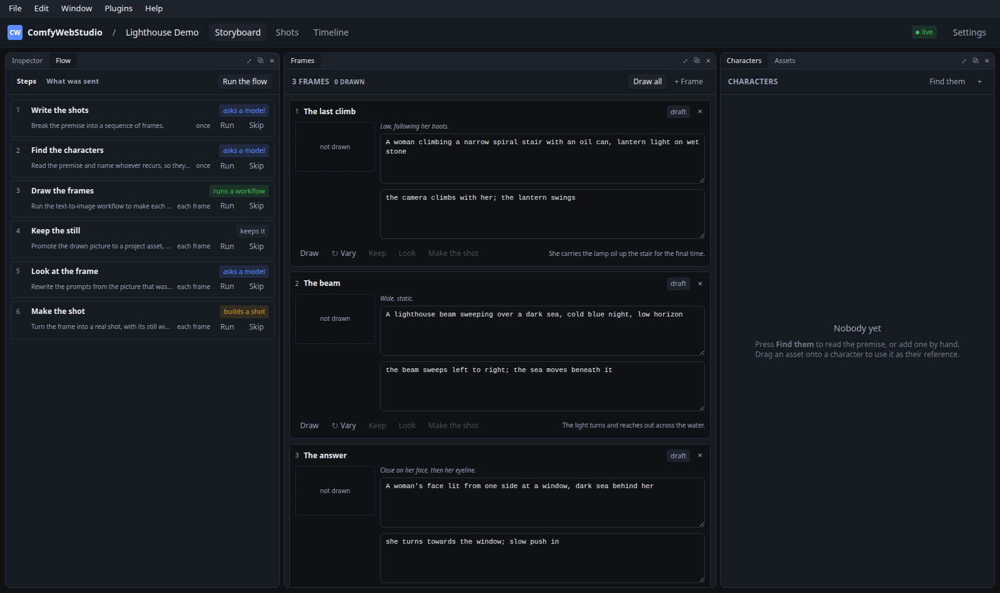

Everything above is a **step**, and the **Flow** panel is the list of them. Nothing about the built-in six
is privileged: you can read what each one asks, change the wording, add your own, turn one off, or run one
on its own.

| | |
|---|---|
| **Run** | runs that step alone — the same as the buttons on the frames, from the other direction |
| **Skip** | leaves the step out, here and when the whole flow runs |
| **Run the flow** | runs them in order, waiting for the drawing to finish before looking at it |

Clicking a step's name opens it.

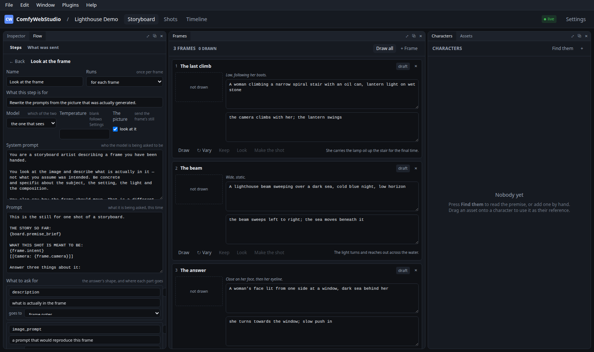

**The prompts are text with `{tokens}` in them.** The palette at the bottom lists every token with *what it
is currently worth*, because the question when writing a prompt is rarely whether `board.premise` exists and
usually what is in it. A token that will not resolve is called out as you type, and if you send it anyway it
arrives at the model verbatim rather than vanishing — a typo should be visible, not silently delete an
instruction.

`[[double brackets]]` mark a piece that disappears when the tokens inside it are empty, which is how
`[[ASPECT: {board.aspect}]]` leaves no dangling heading on a board that has no aspect set.

**What to ask for** is the shape of the answer. Each row is one field — its name, its type, whether the
model must answer it, and where the answer goes. The JSON Schema that constrains the model is generated
from this, so a model cannot reply with the wrong keys or hand back an object where a sentence was asked
for. Pick *somewhere of my own* as the destination to invent a field: name it `wardrobe` and it lands on the
frame and becomes `{frame.fields.wardrobe}` for every later step to use.

Two other things worth knowing:

- **Temperature** left blank follows Settings; filled in, that step alone uses it.
- **If a field comes back empty** is a follow-up question asked only about the parts that came back blank. A
  schema can insist a field is *there*; it cannot insist it says anything, and smaller models will satisfy
  it with `""` and move on.

**Steps are edited per storyboard, over a shared default.** Change a prompt here and only this board sees
it; the rest keep following **Settings ▸ Storyboard flow**, and pick up any improvement made there.
**Reset to default** puts one step back. If the built-in changes in a later version, a step you edited says
so rather than being quietly overwritten.

### Seeing what was actually sent

The **What was sent** tab is the transcript: every exchange, with the rendered system prompt, the rendered
prompt, the raw reply, and where each part of the answer landed.

It is there because *"the model ignored my instruction"* and *"my instruction never reached the model"* look
identical from the outside. One is a prompt to rewrite and the other is a token you mistyped, and the only
way to tell them apart is to read what was sent. A drawing step records the prompts it put into the
workflow, for the same reason.

The last 200 exchanges per board are kept, and they travel with an export only if you include run history.

---

## Timeline and rendering

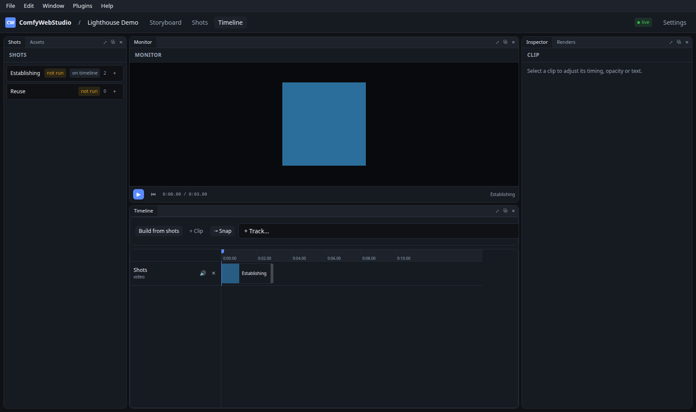

The timeline is a workspace of its own, with the same dockable panels as the shot editor — sources on the
left, the monitor over the tracks, clip settings on the right — arranged and remembered separately, since
cutting and editing want different things on screen.

**Getting clips in.** **Build from shots** lays every shot's final output end to end. To place one shot,
drag it from the Shots bin onto a lane: it lands where you drop it, and if that shot produced sound as
well as picture the audio comes too, on an audio track, lined up with the image. Drag a clip to move it,
drag its edge to trim.

**Placing a shot you have not run.** A shot can be cut in before it has produced anything: the clip
points at the port it *will* fill, shows as waiting, and resolves the moment the shot runs. The bin marks
those shots **not run** so it is a choice rather than a surprise.

**Sound comes with the picture.** A clip whose media carries an audio stream is placed on an audio track
as well, the same length and lined up, and the two are **tied**: they move, trim and delete as one, and
carry a ⛓ so it is clear why. Right-click ▸ **Untie** breaks them apart; **Tie to…** joins a loose clip to
one that overlaps it on another track. A shot that produced a separate audio *output* is placed the same
way.

**Lengths.** A clip takes its length from its media — a five-second sound is a five-second clip. A still
image has no length of its own, so it gets a sensible default you can drag. Pointing a clip at different
material re-times it to that material; **Fit to source** in its right-click menu does the same on demand.

**Snapping.** Edges pull to other clips, the playhead and the start, so cuts butt together exactly instead
of leaving a frame of black nobody notices until the render. The threshold is measured on screen, so
zooming in makes it finer rather than fighting you. **⇥ Snap** turns it off; holding <kbd>Alt</kbd> while
dragging overrides it for that one move.

**Ripple delete.** Drag across empty space on a lane to select a *span of time* — the guide shows where it
snapped — then press <kbd>Delete</kbd>, or right-click for the menu. The span is removed and everything
after it moves back to close the gap; clips straddling an edge are trimmed to it. It applies to every
track by default, because taking time out of the picture but not the sound puts them out of step from
there on. The menu offers one track alone when that is what you mean.

**Which output a clip shows.** A step often produces several things — a picture and an upscale of it, a
video and its audio — and a placed clip has to start on one of them. When there is a choice, the clip
inspector offers it as **Output**, and says which of them the track it is on cannot show (a text output on
a video track, say). Changing it re-resolves the clip without moving or retiming it.

### Audio

Audio clips are drawn as their waveform, because you cut on the silence between words and you cannot see
silence in a coloured rectangle. Trimming redraws the shape rather than squashing it.

Each audio track header carries a mixer strip:

| Control | What it does |
|---|---|
| **S** | Solo — silences every track that is not soloed |
| **M** | Mute. A track silenced by someone else's solo says so, rather than looking like you muted it |
| **lvl** | Track level, multiplied by each clip's own |
| **pan** | Stereo placement, added to each clip's own. Double-click to re-centre |

Selecting an audio clip offers its own volume and pan in the inspector.

**Press play and you hear it.** The preview mix follows the same rules as the render — gains multiply,
pans add, solo silences the rest — so what you hear while cutting is what the file will contain. Panning
uses the constant-power law, so a clip swept across the stereo field keeps its level instead of dipping in
the middle.

**Render** encodes the timeline (PyAV, so no system `ffmpeg` is needed); **Still** exports the frame at the
playhead. A clip whose step has not run yet is flagged before the render starts rather than silently
producing a gap.

---

## Projects, plugins and history

- **Save / export** — a project is a folder of plain files. Export writes a `.cwsproj` archive, optionally
  with its assets and renders; import creates a *second* project rather than overwriting anything.
- **Plugins** — `.cwsplugin` packs carry workflows, shots and templates between installs. They are content
  only, never code, so installing one cannot run anything.
- **History** — <kbd>Ctrl</kbd>+<kbd>H</kbd>. Every change is recorded, and a single element can be
  restored without disturbing the rest of the shot. <kbd>Ctrl</kbd>+<kbd>Z</kbd> undoes as one step what
  the UI did as one action.

---

## Settings

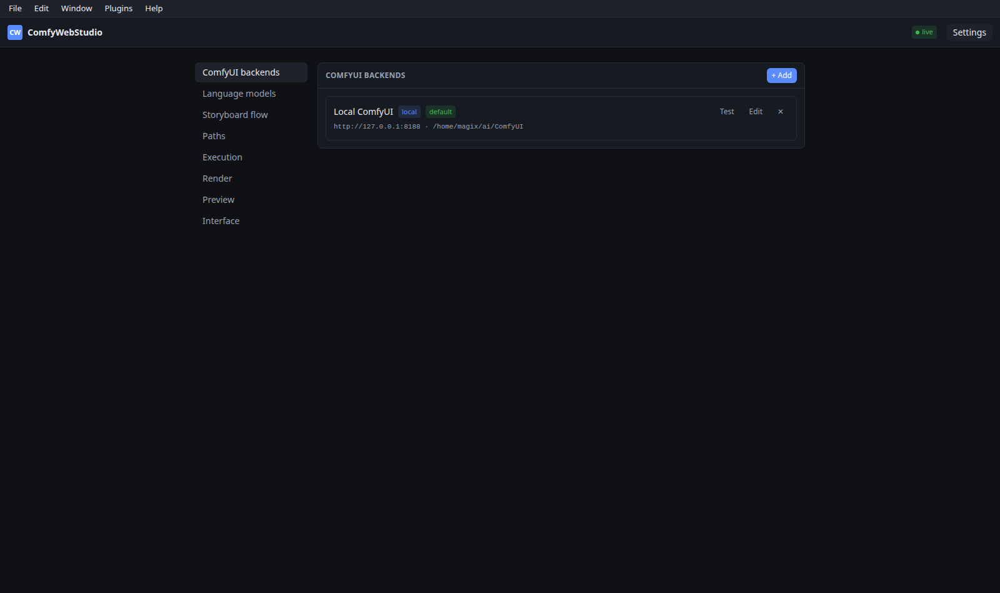

**Backends** — one or more ComfyUI instances, local or remote. A local one that shares a filesystem takes
the fast path (files are linked, never copied); a remote one uploads and downloads over HTTP instead. The
same project runs against either.

**Language models** — what the [storyboard](#storyboards) uses.

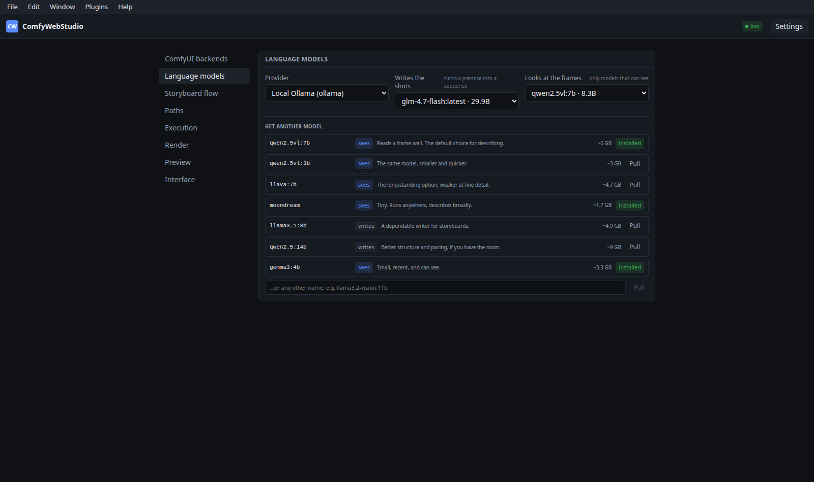

Ollama on this machine is one click. Anything speaking the OpenAI chat API — vLLM, llama.cpp, LM Studio —
works too; give it a base URL.

Two models are chosen separately, because they are two different jobs:

- **Writes the shots** — turns a premise into a sequence.
- **Looks at the frames** — reads a generated still. This list only offers models that can *actually* see:
  the capability is read from the provider, never guessed from the name, because a text-only model handed
  an image will not complain — it will confidently describe nothing at all.

If nothing installed can see, **Get another model** pulls one without leaving the app. The shelf is short and
opinionated (`qwen2.5vl` is the usual choice; `moondream` runs on very little), and any other name can be
typed in. Progress reports itself the same way a render does, and the model is selectable the moment it lands.

**Storyboard flow** — the steps every new storyboard starts with, and the wording they use. The same editor
the [Flow panel](#changing-how-it-works) uses, one layer down: change a prompt here and every board that has
not overridden that step picks it up. A board that *has* keeps its own version, because improving the house
prompt should not undo somebody's careful rewrite.

Also here: where projects and assets live, execution limits and caching, render defaults, preview quality,
and the theme.

---

## When something looks wrong

| What you see | What it means |
|---|---|
| *"needs the node pack"* on a workflow | ComfyUI has no `WS*Output` node in that graph, so nothing can be chained out of it. Add one and save. |
| A step is red with a node name | That ComfyUI node failed. The message is ComfyUI's own. |
| Steps marked *skipped* | Something they depend on failed; fix that one. |
| A parameter you changed in ComfyUI is not showing | That step has a value of its own, which wins. Clear it on the step to follow ComfyUI again. |
| **Open in ComfyUI** warns about syncing | ComfyUI is reachable but the node pack is not answering, so saving there will not come back. |
| A link disappeared after a sync | The port it used no longer exists in the workflow. The toast says which. |
| **Looks at the frames** is empty | Nothing installed can see. Pull a vision model from Settings ▸ Language models. |
| *"Could not reach Ollama"* | It is not running, or not on the URL configured. `ollama serve` and try **Test**. |
| A described frame reads oddly | Small vision models drift. Every field is editable, and **Describe** can be run again. If it is consistently wrong, edit that step's prompt in the **Flow** panel. |
| A step did not do what its prompt says | Open **Flow ▸ What was sent** and read the prompt that actually went. An unresolved `{token}` arrives verbatim, which is usually the answer. |
| A step says its **default moved on** | The built-in wording changed in a newer version and yours did not. Reset it to take the new one, or leave it — nothing overwrites your version. |
| *"no parameter … is set to receive it"* on **Make the shot** | The frame has a motion prompt and the image-to-video workflow has nowhere to put it. Pick one under **Its prompt**; the setup panel warns about this before you get that far. |
| A step is running an old checkpoint or sampler | It should not: a workflow is re-read from ComfyUI whenever it is placed or used. If ComfyUI was unreachable at that moment the stored copy is used instead — **Sync from ComfyUI** in the workflow library forces it. |
| The storyboard flags a reference input | The workflow you chose has no input for it. The assignment is kept; pick a workflow that takes one. |
| **↻ Vary** returns the same picture | The drawing workflow exposes no seed, so there is nothing to vary. Add a `WS Seed Input` to it in ComfyUI. |
| A frame still shows an older picture | The picture shown is whichever is newer, drawn or dropped in. **Redraw** it, or drop the image you want onto it. |

`docs/VERIFY.md` lists every automated suite and a manual checklist; `docs/ARCHITECTURE.md` explains how
the pieces fit together.
